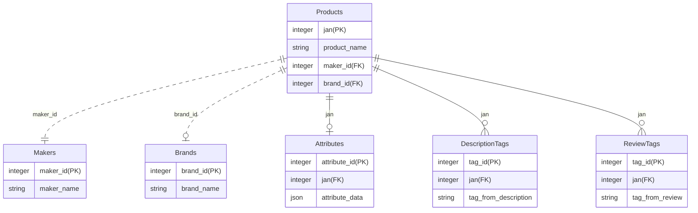

# Lazuli Coding Test
## 今回設計したER図

## AttributeのJSONデータを正規化した場合のER図

~~~
  erDiagram

    Products {
      integer jan(PK)
      string product_name
      integer maker_id(FK)
      integer brand_id(FK)
    }

    Makers {
      integer maker_id(PK)
      string maker_name
    }

    Brands {
      integer brand_id(PK)
      string brand_name
    }

    Attributes {
      integer attribute_id(PK)
      integer jan(FK)
      string attribute_name
    }

    AttributeValues {
      integer attribute_value_id(PK)
      integer attribute_id(FK)
      string attribute_value
    }

    ProductAttributes {
      integer jan(FK)
      integer attribute_id(FK)
      integer attribute_value_id(FK)
    }

    DescriptionTags {
      integer tag_id(PK)
      integer jan(FK)
      string tag_from_description
    }

    ReviewTags {
      integer tag_id(PK)
      integer jan(FK)
      string tag_from_review
    }
~~~
